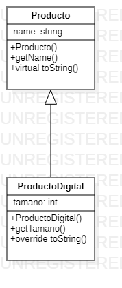

# Introduccion:

En el presente trabajo pretende mostrar el tercer principio básico para la programación orientada a objetos: 
El principio de sustitución de Liskov. Dicho paradigma narra la importancia de una buena abstracción al momento de crear una herencia y como se puede aplicar el polimorfismo adecuadamente. 

# Principio de Sustitucion de Liskov:

De acuerdo con lo que establece García F, Marques J (S.F) se define el concepto del Principio de Sustitución de Liskov como: “[…] un principio en el que define una relación tipo/subtipo basada en el comportamiento, de forma que un tipo se considera subtipo de otro cuando cualquier instancia del primer tipo puede aparecer en cualquier lugar donde se espera una instancia del segundo”. (p.01). De acuerdo con lo anteriormente citado, se demuestra que este principio se basa en una relación de tipo y subtipo dándonos a entender que se aplicará al momento de crear una herencia.

El principio de Liskov es el tercer principio del que nos habla SOLID (establece los cinco principios básicos de la programación orientada a objetos); fue creado por Bárbara Liskov y expuesto en 1987, tiempo después junto con la ayuda de Jeanette Wing se le terminó de dar forma hasta convertirlo en lo que conocemos hoy en día.

# Conclusiones:
Para finiquitar se nos permite concluir que el principio estudiado se encuentra íntimamente relacionado con el paradigma de abierto/cerrado, dejando en claro la importancia fundamental de realizar buenas abstracciones que sirvan de base para las jerarquías de herencia. Por otra parte, la indagación realizada, nos permite obtener un código menos frágil. 

De igual forma se logra concluir que las abstracciones de nuestro programa son correctas, permitiéndonos así desarrollar una mayor cautela a la hora de extender clases, proyectando a la vez una cantidad más baja de errores relacionados con la herencia de clases, logrando a la vez un uso correcto del polimorfismo en tiempo de ejecución, dando a entender que dicho principio está relacionado con conceptos como la cohesión o acoplamiento entre clases (No hables con extraños). 

# Referencias:

García F, Marques J. (S.F.). El Principio de Sustitución de Liskov. Universidad de Burgos & Universidad de Valladolid. Recuperado de: https://repositorio.grial.eu/bitstream/grial/355/1/Liskov.pdf 

Guidi F. (2007). La Programación Orientada a Objetos. Universidad Católica de Valparaíso, Chile. Escuela de Ingeniería Industrial. Extraído de: http://eii.ucv.cl/pers/guidi/cursos/estructuras/pdf/SE-PrincipiosDePOO.pdf

